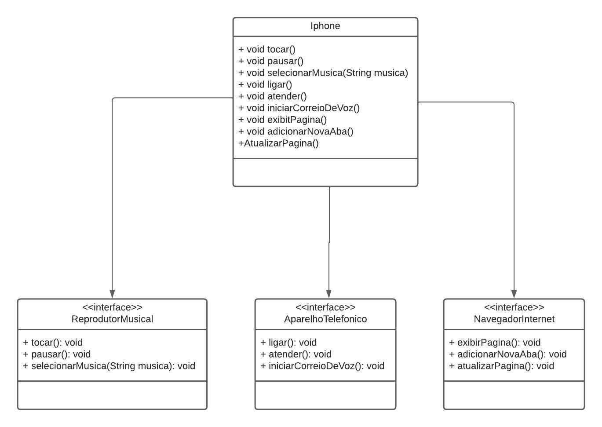

# Desafio iPhone - Modelagem e Diagramação de um componente iPhone 

## Diagrama UML

## Funcionalidades

### Reprodutor Musical
- `tocar()`: Toca a música.
- `pausar()`: Pausa a música.
- `selecionarMusica(String musica)`: Seleciona uma música específica.

### Aparelho Telefônico
- `ligar(String numero)`: Liga para um número.
- `atender()`: Atende uma chamada.
- `iniciarCorreioDeVoz()`: Inicia o correio de voz.

### Navegador na Internet
- `exibirPagina(String url)`: Exibe uma página web.
- `adicionarNovaAba()`: Adiciona uma nova aba no navegador.
- `atualizarPagina()`: Atualiza a página web atual.